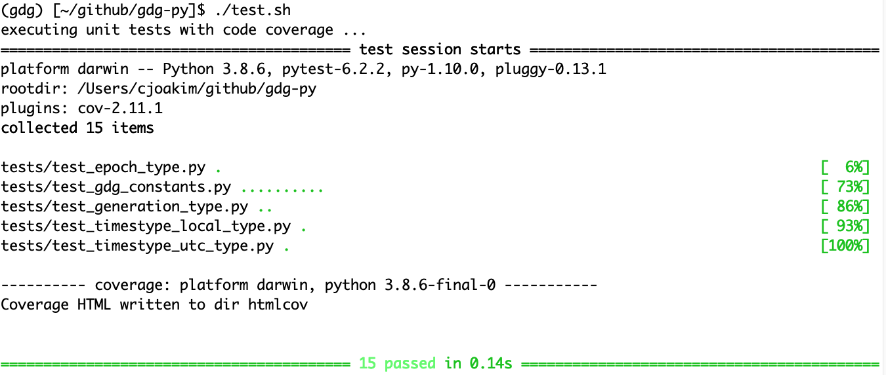
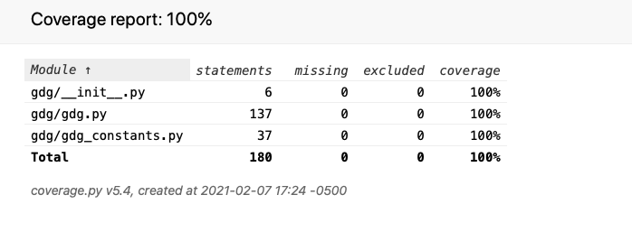

# gdg-py

home of the [gdg](https://pypi.org/project/gdg/) python library - generation data groups

## PyPI

- [gdg @ PyPI](https://pypi.org/project/gdg/)

## PyTest Test Results

### Unit Tests

### Code Coverage

